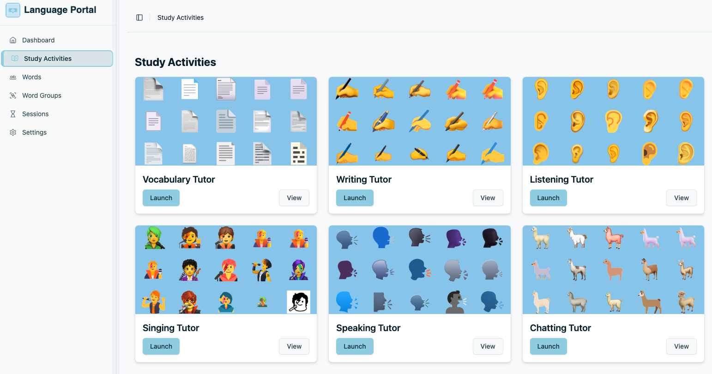
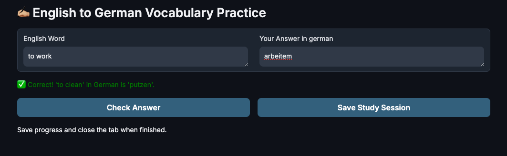
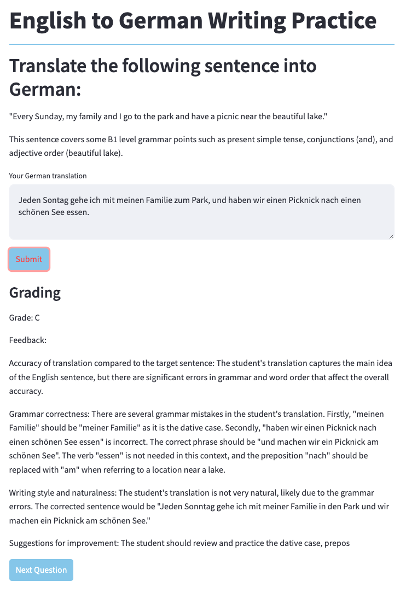
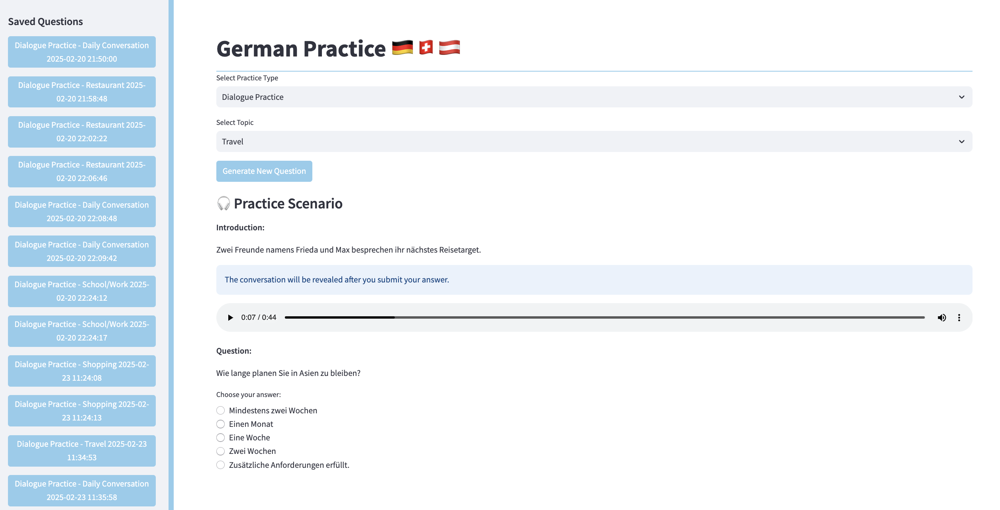
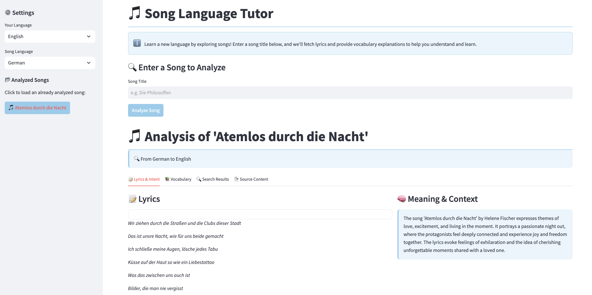
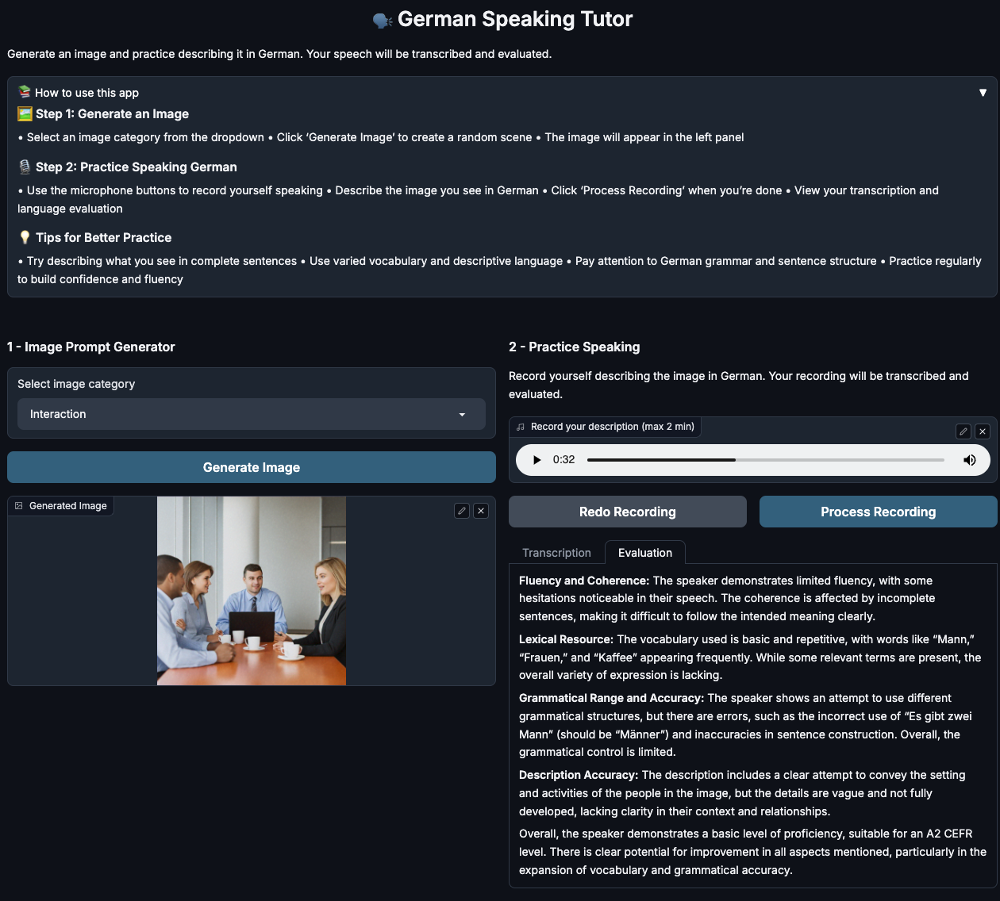
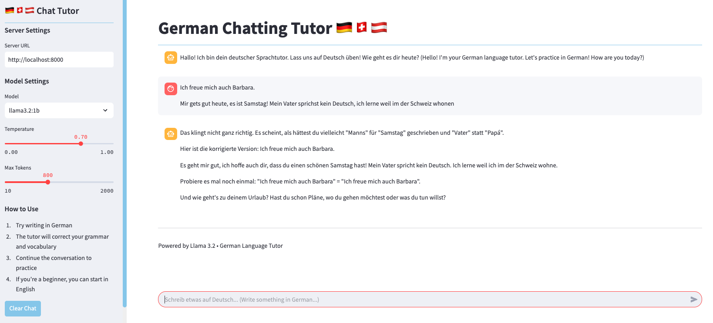

# Free GenAI Bootcamp 2025

**GenAI Training and Hands-on Programming** This bootcamp provides hands-on
experience with Generative AI through real-world projects. The official course
site can be found [here](https://genai.cloudprojectbootcamp.com/).

## Setup

Sets up a complete development environment for the project by installing and
configuring Node.js via nvm, creating three separate Python virtual environments
(Base, Gradio, and OPEA) with their respective dependencies, and initializing a
SQLite database if one doesn't already exist.

```bash
make setup
```

## Start Website Locally

Start the microservices-based language learning system, checking for Docker
availability to determine whether to launch the full system (including LLM
services with Llama 3.2) or just core services.

```bash
# Remember to have Docker running, otherwise the ollama-server will not run.
make start
```

## Currently Supported Apps



### Vocabulary Tutor

A Gradio-based web application for practicing English to German vocabulary
through interactive flashcards. Learning progress is tracked and saved to the
backend.



### Writing Tutor

An AI-powered application for practicing English to German translations with
immediate feedback.

AI Model: AWS Bedrock (Mistral Large).



### Listening Tutor

Application for listening comprehension and dialogue practice
in German, featuring AI-generated scenarios and audio.

- Audio generated with: Anthropic Claude 3 Haiku.
- Chat and questions text with: Mistral 7b.



### Singing Tutor

A Streamlit-based application for language learning through music, analyzing
songs to extract vocabulary and context.

Uses a custom language analysis agent that:

- Performs web searches using DuckDuckGo Search API
- Extracts and parses song lyrics from web pages
- Processes vocabulary using OpenAI's GPT-4o Mini model
- Identifies language learning opportunities in song content



### Speaking Tutor

An AI-powered application for practicing German speaking skills using generated
images as conversation prompts.

AI Services:

- AWS Bedrock `amazon.titan-image-generator-v1` for image generation
- OpenAI Whisper for speech-to-text
- OpenAI GPT-4o Mini for language evaluation



### Chatting Tutor

Application that provides an interactive German language tutor powered by a self
hosted LLM. Llama 3.2 via Ollama Third-Party Service. Users interact with a chat
interface where they can practice writing in German

- FastAPI microservice architecture
- API Protocol: Server-Sent Events (SSE) for streaming responses
- Communication: Asynchronous HTTP with aiohttp


