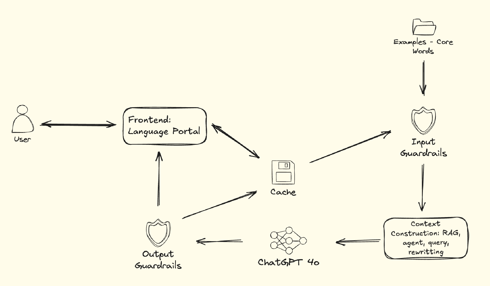

# Architecting GenAI

**Business Goal** 

>As a Solution Architect after consulting with real-world AI Engineers, you have
been tasked to create architectural diagram(s) that serve as a teaching aid to
help stakeholders understand their key components of GenAI workloads. The
outcome is to help let stakeholders visualize possible technical paths,
technical uncertainty when adopting GenAI. We are guiding key stakeholders
through the technical landscape without directly prescribing solutions, while
fostering informed discussions about infrastructure choices, integration
patterns, and system dependencies across the organization.

## Conceptual Diagram

A high level diagram that is used to communicate to key stakeholders the
business solution we are implementing.

Download `./architecting_genai.excalidraw` for editable chart.

## Architectural & Design Considerations

### Requirements, Risks, Assumptions, & Constraints

#### Requirements

Business:
- Develop language-learning AI assistants for Japanese and German.
- Ensure AI provides guidance rather than direct answers.

Functional:
- User Interface: A Language Portal for interaction.
- AI Processing: ChatGPT-4o for sentence construction and error detection.
- Guardrails: Input and output validation to ensure educational and appropriate
  responses.

Non-Functional:
- Performance: Low-latency interactions for smooth user experience.
- Usability: Intuitive and language-learning-friendly UI.

Tooling:
- GenAI vs ML: Heavily dependent on ChatGPT-4o, focusing on prompt engineering,
  context refinement, and guardrails instead of full model training.

#### Risks

- Model Hallucination: AI might generate inaccurate translations or guidance.
- Data Privacy Concerns: Potential leakage of user inputs.
- Bias in AI Responses: Unintended linguistic or cultural biases.
- Performance Bottlenecks: Cache inefficiencies or API rate limits.
- Dependence on External APIs: SaaS model limitations for ChatGPT-4o.

#### Assumptions

- Users will have basic proficiency in English or German/Japanese.
- ChatGPT-4o's API will remain stable and accessible.
- Guardrails will be sufficient to prevent misuse.
- Caching will improve response time and reduce API calls.

#### Constraints

- Fixed Budget: Limited by the ChatGPT-4o subscription and infrastructure costs.
- Data Availability: Limited by the examples and core words database.

### Data Strategy

- Data Collection & Preparation: Core words & example sentences.
- Data Quality: Ensure diverse linguistic examples for accurate AI responses.
- Privacy & Security: No personally identifiable information (PII) storage.
- Integration: Cache strategy to minimize redundant API calls.

### Model Selection & Development

- Self-Hosted vs SaaS: SaaS (ChatGPT-4o) for simplicity and efficiency.
- Model Type: Text-to-text processing.
- Context Construction: Using RAG for enhanced query responses.

### Infrastructure Design

- Cloud-Based Deployment: Ensures scalability and resilience.
- Modular Architecture: Easy updates and component replacements.
- Hybrid Strategy: Mix of caching, API calls, and localized data storage.

### Integration & Deployment

- APIs & Interfaces: Well-structured APIs for seamless frontend-backend
  interaction.
- CI/CD Pipelines: Automate deployment for guardrails, caching, and UI updates.

### Monitoring & Optimization

- Logging & Telemetry: Track user interactions.
- Feedback Loops: User-reported errors and feedback for continuous improvement.
- Billing Alerts: Monitor ChatGPT-4o usage to prevent excessive costs.

### Governance & Security

- Responsible AI Usage: AI must guide, not provide direct answers.

### Scalability & Future-Proofing

- Version Control: Track project updates and AI behavior.

## Business Considerations

### Use Cases

- Japanese Sentence Constructor: Assist learners in translating English to
  Japanese with guided feedback.
- German Writing Correction Assistant: Provide error detection without direct
  answers, fostering active learning.

Outcome: Improved language proficiency for users through AI-assisted feedback
rather than passive learning.

### Complexity of Integrating GenAI (LLMs) into Workloads

Moving Parts & Maintenance Needs:
- Frontend (Language Portal)
- ChatGPT-4o API
- Guardrails (Input/Output validation) – Updating based on misuse patterns &
  user feedback.
- Cache (Performance optimization)
- Context Construction (RAG, agent, query refinement)
- Periodic Model Evaluations – Ensuring responses stay relevant & accurate.

###  Key Levers of Cost

- Compute Costs: Model inference cost (ChatGPT-4o API usage, response volume).
- Infrastructure: Cloud hosting costs, storage for logs & context caching.
- Model Selection: Choosing lighter models vs. full-sized ChatGPT-4o impacts
  cost.
- API Rate Limits: Potential overages from high API usage, requiring caching &
  optimization.
- Monitoring & Maintenance: Human oversight, logging systems, evaluation tools.

### Lock-in Considerations

- Vendor Dependence: Use open APIs & standards for flexibility.
- Rising Costs ("Rug Pulls"): Implement cost monitoring & budgeting tools.
- Better Models in the Future: Design with modular architecture to swap models
  easily.
- Cloud vs. On-Premise: Consider hybrid solutions for cost control &
  sovereignty.
