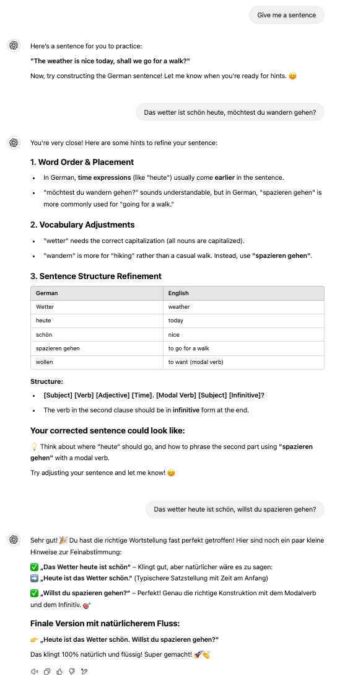

# ChatGPT Powered Assistant Guide

**Model: GPT 4o**

## Prompting Guides

https://platform.openai.com/docs/guides/prompt-engineering

## Example

The agent seems to insist on providing the correct translation in the end, even
after I repeatedly instructed it not to in the [prompt](./PROMPT.md).
Fortunately, this only happens after the correct answer has already been given.
Note that the answer wasn't 100% accurate, but I think that's
acceptable, otherwise it could become annoying.

