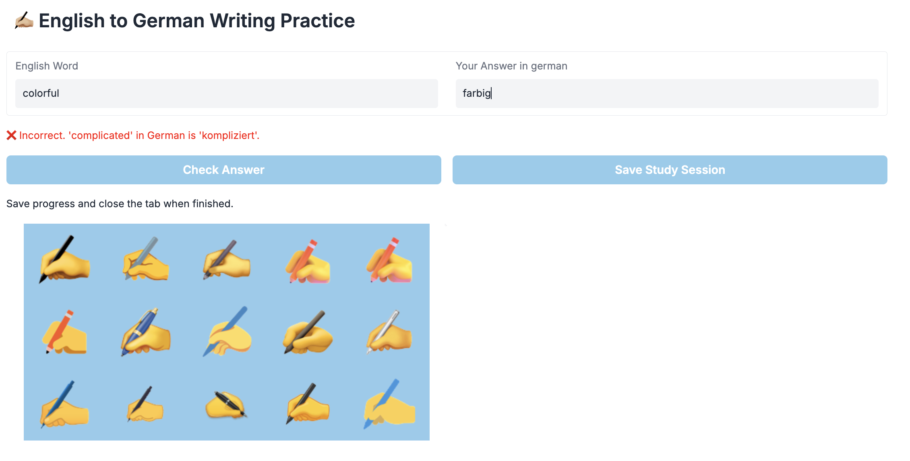

# Vocabulary Practice

Sample Exercise:



A Gradio-based web application for practicing English to German vocabulary through interactive flashcards.

Backend: Python with Flask backend API
Data Storage: Database accessed via REST API

## How It Works

The app fetches random English-German word pairs from predefined word groups
Users are shown English words and must type the German equivalents
The system provides immediate feedback on correctness
Learning progress is tracked and saved to the backend

## Run Gradio App

```bash
gradio app.py
```
